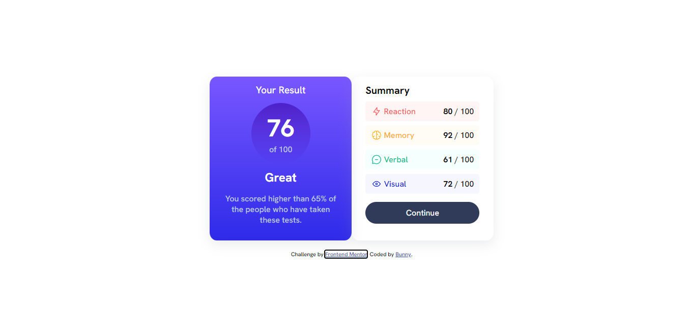
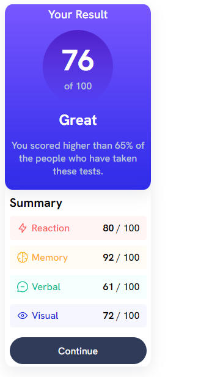

# Frontend Mentor - Results summary component solution

This is a solution to the [Results summary component challenge on Frontend Mentor](https://www.frontendmentor.io/challenges/results-summary-component-CE_K6s0maV). Frontend Mentor challenges help you improve your coding skills by building realistic projects.

## Table of contents

- [Overview](#overview)
  - [The challenge](#the-challenge)
  - [Screenshot](#screenshot)
  - [Links](#links)
- [My process](#my-process)
  - [Built with](#built-with)
  - [What I learned](#what-i-learned)
  - [Useful resources](#useful-resources)
- [Author](#author)

**Note: Delete this note and update the table of contents based on what sections you keep.**

## Overview

### The challenge

Users should be able to:

- View the optimal layout for the interface depending on their device's screen size
- See hover and focus states for all interactive elements on the page

### Screenshot




### Links

- Solution URL: [Add solution URL here](https://your-solution-url.com)
- Live Site URL: [Add live site URL here](https://your-live-site-url.com)

### Built with

- Semantic HTML5 markup
- CSS custom properties
- Flexbox
- CSS Grid
- Mobile-first workflow

### What I learned
```css
@media only screen and (max-width: 600px) {
  .container { display: contents; }
  .summaryOverview {
    position: relative;
    top: -1rem;
  }
}

### Useful resources

- [W3Schools](https://www.w3schools.com/css/css_rwd_mediaqueries.asp) - This helped me to get me kickstarted on the use of some advance css like @media and linear-gradient.

## Author

- LinkedIn - [Mukesh Kumar](https://www.linkedin.com/in/mukesh-kumar-00469b227/)
- Frontend Mentor - [@bunnyBites](https://www.frontendmentor.io/profile/bunnyBites)
- Twitter - [@BunnyBites666](https://twitter.com/BunnyBites666)

**Note: Delete this note and add/remove/edit lines above based on what links you'd like to share.**

